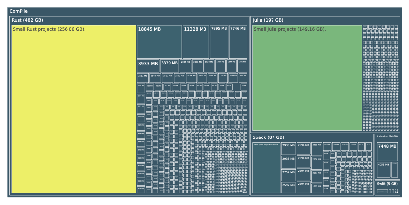
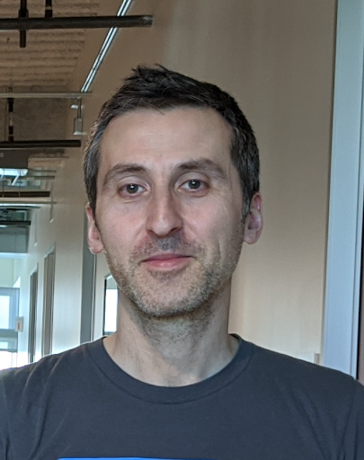
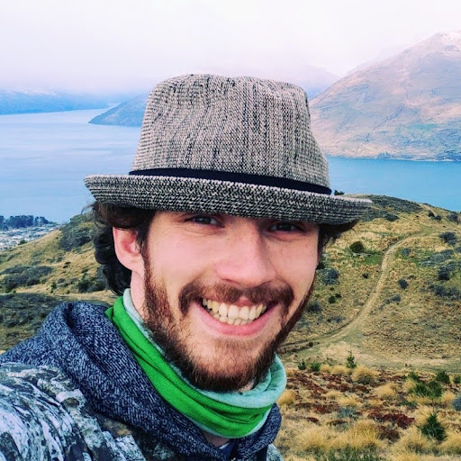

## Abstract

Code is increasingly becoming a core data modality of modern machine learning research impacting not only the way we write code
with conversational agents like OpenAI's ChatGPT, Google's Bard, or Anthropic's Claude, the way we translate code from one language
into another, but also the compiler infrastructure underlying the language. While modeling approaches may vary and representations differ,
the targeted tasks often remain the same within the individual classes of models. Relying solely on the ability of modern models to extract
information from unstructured code does not take advantage of 70 years of programming language and compiler development by not utilizing the
structure inherent to programs in the data collection. This detracts from the performance of models working over a tokenized representation
of input code and precludes the use of these models in the compiler itself. To work towards better intermediate
representation (IR) based models, we fully utilize the LLVM compiler infrastructure, shared by a number of languages, to generate
a 182B token dataset of LLVM IR. We generated this dataset from programming languages built on the shared LLVM
infrastructure, including Rust, Swift, Julia, and C/C++, by hooking into LLVM code generation either through the language's package
manager or the compiler directly to extract the dataset of intermediate representations from production grade programs.
Our dataset shows great promise for large language model training, and machine-learned compiler components.

## The Dataset at a Glance



Broken down into the specific sizes of the content of ComPile in the different LLVM-based languages contained in ComPile:

| Language | C | C++ | Julia | Rust | Swift | Total |
|:-------------|:----|:----|:----|:----|:----|:----|
| Size (Bitcode) | 13 GB | 81 GB | 197 GB | 482 GB | 5 GB | 778 GB |
| Size (Text) | 61 GB | 334 GB | 1292 GB | 1868 GB | 22 GB | 3577 GB |
| Deduplicated Size (Bitcode) | 8 GB | 67 GB | 130 GB | 310 GB | 4 GB | 518 GB |
| Deduplicated Size (Text) | 34 GB | 266 GB | 856 GB | 1221 GB | 19 GB | 2395 GB |

To arrive at a permissively licensed subset we filter the dataset for the following 4 licenses:

* [MIT](https://spdx.org/licenses/MIT.html)
* [Apache-2.0](https://spdx.org/licenses/Apache-2.0.html)
* [BSD-3-Clause](https://spdx.org/licenses/BSD-3-Clause-Clear.html)
* [BSD-2-Clause](https://spdx.org/licenses/BSD-2-Clause.html)

The license information for the filtering is obtaines from package repositories, GitHub, and if required manually using the [go-license-detector](https://github.com/go-enry/go-license-detector). Provenance information, and license text are distributed alongside the dataset to comply with terms.

| Source | Total | Under Permissive Licenses | with License Files |
|:-------------|:-------|:------|:------|:------|:------|
| Rust | 586 GB | 468 GB | 394 GB |
| Julia | 210 GB | 186 GB | 186 GB |
| Spack (C/C++) | 118 GB | 67.3 GB | 45.5 GB |
| Swift | 7.35 GB | 6.93 GB | 6.93 GB |

This results in the following number of tokens of the closed, and public version of ComPile under increasing vocabulary sizes:


| Vocabulary Size | 10,000 | 50,000 | 100,000 | 200,000 |
|:-------------|:-------|:------|:------|:------|:------|
| ComPile (closed) | 182 B | 119 B | 102 B | 87 B |
| ComPile (public) | 144 B | 94 B | 81 B | 69 B |

> The tooling to reproduce both version of the datasets is publicly available on [Zenodo](https://zenodo.org/records/10155761).

## Relation to Other Datasets

In literature there exist a number of related datasets of different sizes, and for a wide variety of code-related tasks. At a glance:

| Name of Dataset  | Tokens          | Size | Languages |
|:-------------|:------------------|:------|:---------|
| [The Stack](https://arxiv.org/abs/2211.15533) | - | 2.9 TB | 358 Languages |
| **ComPile (closed)** | **182 B**   | **2.4 TB** | **Rust, Swift, Julia, C/C++** |
| **ComPile (public)** | **144 B** | **1.9 TB** | **Rust, Swift, Julia, C/C++** |
| [Code Llama](https://arxiv.org/abs/2308.12950) | 197 B | 859 GB | - |
| [TransCoder](https://arxiv.org/abs/2006.03511) | 163 B | 744 GB | C++, Java, Python |
| [AlphaCode](https://arxiv.org/abs/2203.07814) | - | 715.1 GB | 12 Languages |
| [LLM for Compiler Opt.](https://arxiv.org/abs/2309.07062) | 373 M | 1 GB | C/C++ |

## Authors

<div class="row1">
    <center>
    <div style="float:left;margin-right:20px;">
        
        <p style="text-align:center;"><a href="https://aidengrossman.com">Aiden Grossman</a></p>
    </div>
    <div style="float:left;margin-right:20px;">
        
        <p style="text-align:center;"><a href="https://ludger.fyi">Ludger Paehler</a></p>
    </div>
    <div style="float:left;margin-right:20px;">
        
        <p style="text-align:center;"><a href="https://www.linkedin.com/in/kostadinos-parasyris-3992b950">Konstadinos Parasyris</a></p>
    </div>
    </center>
</div>

<div class="row2">
    <center>
    <div style="float:left;margin-right:20px;">
        
        <p style="text-align:center;"><a href="https://tbennun.github.io">Tal Ben-Nun</a></p>
    </div>
    <div style="float:left;margin-right:20px;">
        
        <p style="text-align:center;"><a href="https://www.linkedin.com/in/jacob-hegna">Jacob Hegna</a></p>
    </div>
    <div style="float:left;margin-right:20px;">
        
        <p style="text-align:center;"><a href="https://wsmoses.com/academic/">William S. Moses</a></p>
    </div>
    </center>
</div>

<div class="row3">
    <center>
    <div style="float:left;margin-right:20px;">
        
        <p style="text-align:center;"><a href="https://www.anl.gov/profile/jose-manuel-monsalve">Jose Monsalve-Diaz</a></p>
    </div>
    <div style="float:left;margin-right:20px;">
        
        <p style="text-align:center;"><a href="https://research.google/people/mircea-trofin/">Mircea Trofin</a></p>
    </div>
    <div style="float:left;margin-right:20px;">
        
        <p style="text-align:center;"><a href="https://people.llnl.gov/doerfert1">Johannes Doerfert</a></p>
    </div>
    </center>
</div>

<br/><br/><br/><br/><br/><br/><br/><br/><br/><br/><br/><br/><br/><br/><br/><br/><br/><br/><br/><br/><br/><br/><br/><br/><br/><br/><br/><br/><br/><br/><br/>

## Corresponding Author

* Aiden Grossman ([amgrossman@ucdavis.edu](mailto:amgrossman@ucdavis.edu?subject=ComPile))

## Citation

```bibtex
@article{grossman2023compile,
  title={ComPile: A Large IR Dataset from Production Sources},
  author={Grossman, Aiden and Paehler, Ludger and Parasyris, Konstantinos and Ben-Nun, Tal
          and Hegna, Jacob and Moses, William and Diaz, Jose M Monsalve and Trofin, Mircea
          and Doerfert, Johannes},
  journal={arXiv preprint arXiv:2309.15432},
  year={2023}
}
```
